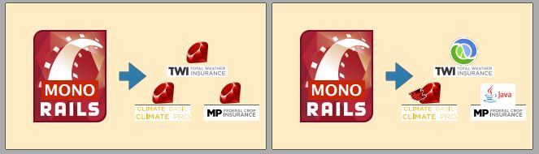
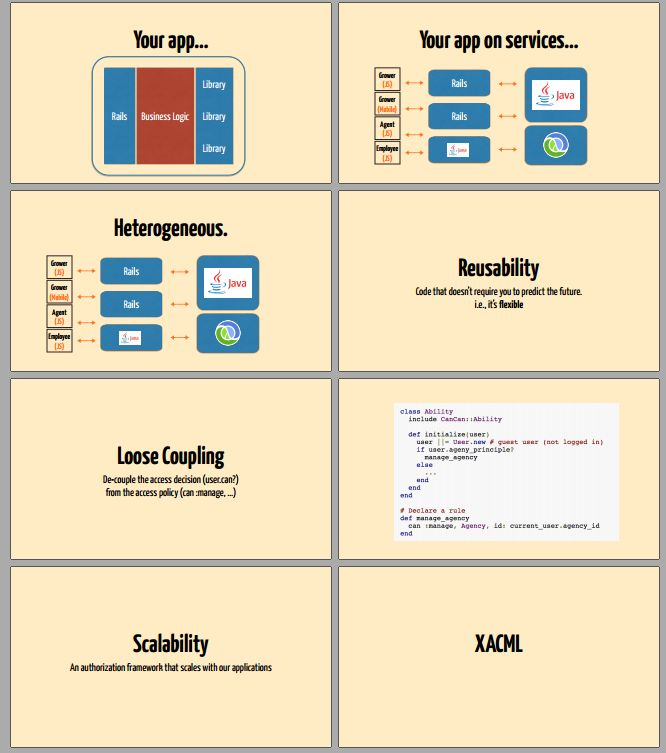

## The Climate Corporation

The Climate Corporation is a San Francisco-based company that examines weather data to provide insurance to farmers who can lock in profits even in the case of drought, heavy rains or other adverse weather conditions. Wikipedia

**Founded**: 2006

### References

- [Video](https://www.youtube.com/watch?v=6tQTwmIgclE)
- [Slides](https://speakerdeck.com/lumberj/authorization-in-a-service-oriented-environment)
- Blog:
  - [Handling Authorization in a Service-Oriented Architecture](http://eng.climate.com/2014/02/12/service-oriented-authorization-part-1/)
  - [Handling Authorization in a Service-Oriented Architecture (Part 2)](http://eng.climate.com/2014/02/25/handling-authorization-in-a-service-oriented-architecture-part-2/)
  - [Service Oriented Authorization – Part 3](http://eng.climate.com/2014/05/15/service-oriented-authorization-part-3/)

### Case Study

Service Oriented Authorization

**What is authorization?**
* Authentication => Identity
* Authorization => Access

**Types of Authorization**
* Role Base Access Control (RBAC)
* Attribute Based Access Control (ABAC)
* Access Control Lists (ACL)
* Rule Based Access Control

> What is "Service Oriented Architecture"?
"A loosely-coupled architecture designed to meet the business needs of the
organization."

Goals:
- Reusability
- Scalability
- Loose Coupling

