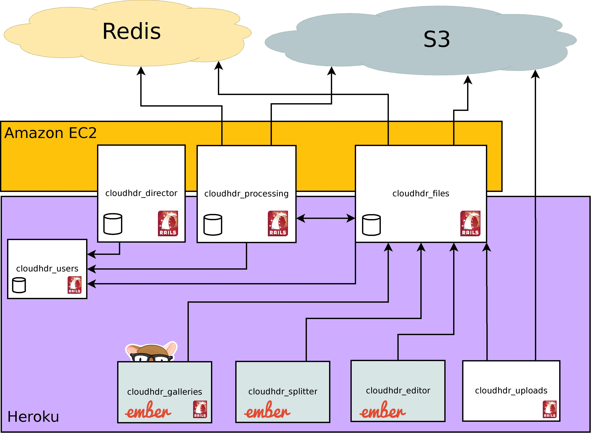

## CloudHDR

CloudHDR - HDR Photo Processing Automation

### References
- **Video**:
  - [RailsConf 2014 - Service Oriented Authenication by Jeremy Green](https://www.youtube.com/watch?v=L1B_HpCW8bs)
- [Slides](http://jagthedrummer.github.io/service_oriented_authentication)
 - These slides are in github
- Repos
  - https://github.com/jagthedrummer/so_auth_provider
  - https://github.com/jagthedrummer/so_auth
  - https://github.com/jagthedrummer/so_auth_client
- Demos
  - http://so-auth-provider.octolabs.com/
  - http://so-auth-client.octolabs.com/

### Case Study

Service Oriented Authentication, based on **OAuth 2**

Getting started with authentication in SOA environments can seem like a daunting subject, but it doesn't need to be difficult. This talk will cover everything you need to know to get started building your own SOA systems. We'll look at the details of building a centralized authentication service and allowing other apps to delegate their authentication needs to the service.

Very interesting intro and practical samples of OAuth.

