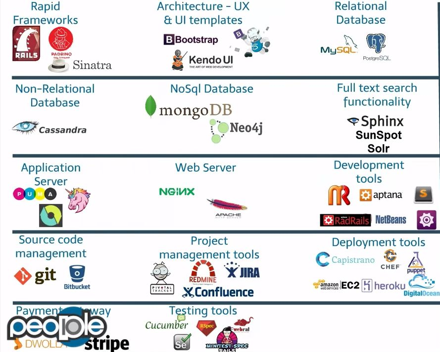
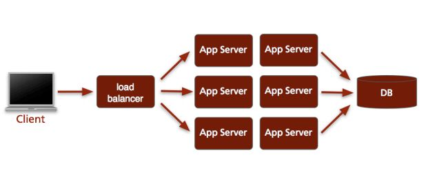
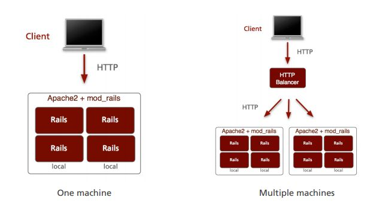
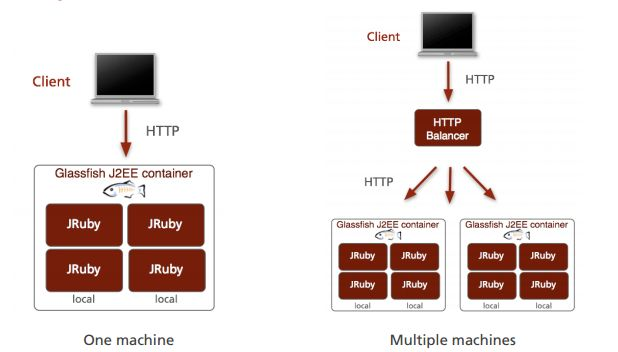
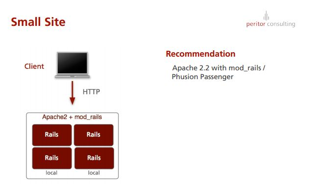
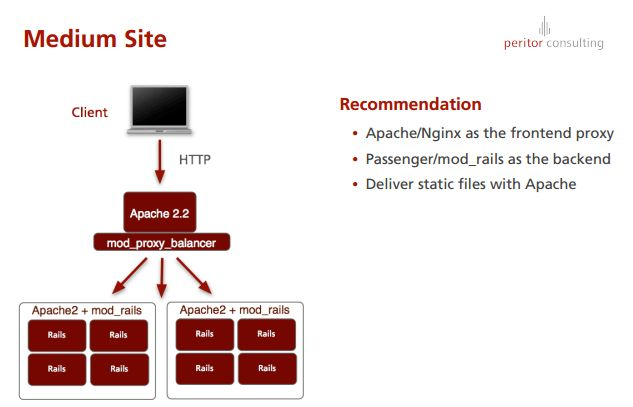
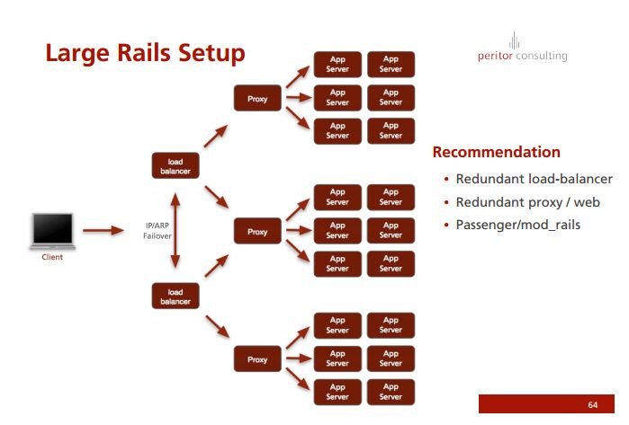
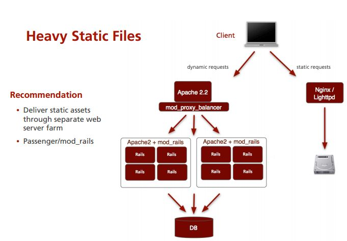
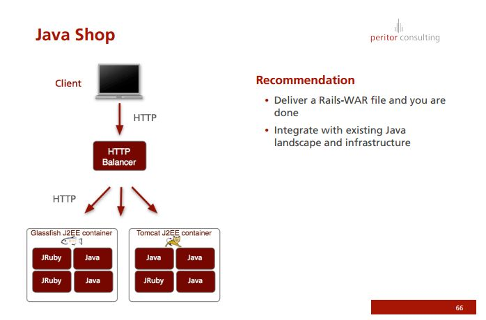

## Deploying And Monitoring Rails

While it’s easy to get started developing applications using Ruby on Rails, the hard part is (as with most technologies) how to put it into production? There are a lot of options like Mongrel, nginx, Apache and JRuby, all of them difficult to evaulate without deeper knowledge of Rails and your application’s scaling needs. We will look at the available options to get a clearer picture how each setup is in different situations, and how you can utilize Capistrano for an easy deployment process in those situations. Simple as well as more complex setups will be discussed. We’ll try to include your problems as well as your experiences to discuss specific issues with deployment and scalability.

### References
- **Slides**:
  - [Deploying And Monitoring Rails](http://www.slideshare.net/jweiss/deploying-and-monitoring-rails)
    - It's a practical guide dated 2009. I guess there may be better tools, but conceptually the deployment architecture must be the same.
- [Ruby on Rails Server options][1]

[1]: http://stackoverflow.com/questions/4113299/ruby-on-rails-server-options/4113570#4113570

### Case Study

#### Simple Rails Setup
One Rails instance handles all requests.
Rails is single-threaded: There is only one concurrent request.

#### Typical Rails Setup
- A load-balancer distributes the incoming requests
- Some load-balancers will deliver static requests themselves
- Several Rails instances handle all requests
- Number of concurrent requests equals number of Rails instances

#### Phusion Passenger

- Ready for production
- Makes setup easier – on the single machine level
- Multiple servers still require load balancer
- Suitable for mass-hosting
- upcoming standard way of deploying Rails

##### JRuby on Rails
- Ruby Runtime on the Java Virtual Machine
- Implemented in Java and Ruby
- Compiles Ruby into Java-bytecode
- Integrates with Java code and libraries
- Java’s promises of native threads and JIT
- Allows for Ruby/Rails applications to be packaged as WAR files
- WAR files deployable on any J2EE-container: Glassfish, JBoss, Tomcat, Jetty

##### Proxy Requirements
- Hide cluster backend from the user
- Load-balancer backend instances
- Recognize down hosts
- Fair scheduler
- (Deliver static content)

**Proxy Vendors**:
- Apache
- Nginx
- Lighttpd
- HAProxy

#### Recommended Setups

### Ruby on Rails Server options
> This is a copy of SO post [Ruby on Rails Server options][1]

The word "deployment" can have two meanings depending on the context. You are also confusing the roles of Apache/Nginx with the roles of other components.

Historic note: This article was originally written on November 6, 2010, when the Ruby app server ecosystem was limited. I've updated this article on March 15 2013 with all the latest updates in the ecosystem.

**Disclaimer**: I am one of the authors of Phusion Passenger, one of the app servers.

## Apache vs Nginx

They're both web servers. They can serve static files but - with the right modules - can also serve dynamic web apps e.g. those written in PHP. Apache is more popular and has more features, Nginx is smaller and faster and has less features.

Neither Apache nor Nginx can serve Ruby web apps out-of-the-box, to do that you need to use Apache/Nginx in combination with some kind of add-on, described later.

Apache and Nginx can also act as reverse proxies, meaning that they can take an incoming HTTP request and forward it to another server, which also speaks HTTP. When that server responds with an HTTP response, Apache/Nginx will forward the response back to the client; You will learn later why this is relevant.

## Mongrel and other production app servers vs WEBrick

Mongrel is a Ruby "application server": In concrete terms this means that Mongrel is an application which:

1. Loads your Ruby app inside its own process space.
2. Sets up a TCP socket, allowing it to communicate with the outside world (e.g. the Internet).
Mongrel listens for HTTP requests on this socket and passes the request data to the Ruby web app.
3. The Ruby web app then returns an object, which describes what the HTTP response should look like, and Mongrel takes care of converting it to an actual HTTP response (the actual bytes) and sends it back over the socket.

However Mongrel is quite dated, nowadays it is no longer maintained. Newer alternative application servers are:

 * Phusion Passenger
 * Unicorn
 * Thin
 * Puma
 * Trinidad (JRuby only)
 * TorqueBox (JRuby only)

I'll cover them later and describe how they differ from each other and from Mongrel.

WEBrick does the same thing as Mongrel, but the differences are:

* WEBrick is not fit for production, unlike everything else that I mentioned before. WEBrick is written entirely in Ruby. Mongrel (and most other Ruby app servers) is part Ruby and part C (Mostly Ruby), but its HTTP parser is written in C for performance.
* WEBrick is slower and less robust. It has some known memory leaks and some known HTTP parsing problems.
* WEBrick is usually only used as the default server during development because WEBrick is included in Ruby by default. Mongrel and other app servers needs to be installed separately. It's not recommended to use WEBrick in production environments, though for some reason Heroku chose WEBrick as its default server. They were using Thin before, so I have no idea why they switched to WEBrick.

## The app server and the world

All current Ruby app servers speak HTTP, however some app servers may be directly exposed to the Internet on port 80, while others may not.

 * App servers that can be directly exposed to the Internet: Phusion Passenger, Rainbows
 * App servers that may not be directly exposed to the Internet: Mongrel, Unicorn, Thin, Puma. These app servers must be put behind a *reverse proxy web server* like Apache and Nginx.
 * I don't know enough about Trinidad and TorqueBox, so I've omitted them.

Why must some app servers be put behind a reverse proxy?

 * Some app servers can only handle 1 request concurrently, per process. If you want to handle 2 requests concurrently you need to run multiple app server instances, each serving the same Ruby app. This set of app server processes is called an *app server cluster* (hence the name Mongrel Cluster, Thin Cluster, etc). You must then setup Apache or Nginx to reverse proxy to this cluster. Apache/Nginx will take care of distributing requests between the instances in the cluster (More on this in section "I/O concurrency models").
 * The web server can buffer requests and responses, protecting the app server from "slow clients" - HTTP clients that don't send or accept data very quickly. You don't want your app server to do nothing while waiting for the client to send the full request or to receive the full response, because during that time the app server may not be able to do anything else. Apache and Nginx are very good at doing many things at the same time because they're either multithreaded or evented.
 * Most app servers can serve static files, but are not particularly good at it. Apache and Nginx can do it faster.
 * People typically set up Apache/Nginx to serve static files directly, but forward requests that don't correspond with static files to the app server, it's good security practice. Apache and Nginx are very mature and can shield the app server from (perhaps maliciously) corrupted requests.

Why can some app servers be directly exposed to the Internet?

 * Phusion Passenger is a very different beast from all the other app servers. One of its unique features is that it integrates into the web server.
 * The Rainbows author publicly stated that it's safe to directly expose it to the Internet. He's fairly sure that there are no vulnerabilities in his HTTP parser (and similar), still, the author provides no warranty and says that usage is at own risk.

## Application servers compared

In this section I'll compare most application servers I've mentioned, but not Phusion Passenger. Phusion Passenger is such a different beast from the rest that I've given it a dedicated section. I've also omitted Trinidad and TorqueBox because I do not know them well enough, but they're only relevant anyway if you use JRuby.

 * **Mongrel** was pretty bare bones. As mentioned earlier, Mongrel is purely single-threaded multi-process, so it is only useful in a cluster. There is no process monitoring: if a process in the cluster crashes (e.g. because of a bug in the app) then it needs to be manually restarted. People tend to use external process monitoring tools such as Monit and God.
 * **Unicorn** is a fork of Mongrel. It supports limited process monitoring: if a process crashes it is automatically restarted by the master process. It can make all processes listen on a single shared socket, instead of a separate socket for each process. This simplifies reverse proxy configuration. Like Mongrel, it is purely single-threaded multi-process.
 * **Thin** uses the evented I/O model by utilizing the EventMachine library. Other than using the Mongrel HTTP parser, it is not based on Mongrel in any way. Its cluster mode has no process monitoring so you need to monitor crashes etc. There is no Unicorn-like shared socket, so each process listens on its own socket. In theory, Thin's I/O model allows high concurrency, but in most practical situations that Thin is used for, one Thin process can only handle 1 concurrent request, so you still need a cluster. More about this peculiar property in section "I/O concurrency models".
 * **Puma** was also forked from Mongrel, but unlike Unicorn, Puma is designed to be purely multi-threaded. There is therefore currently no builtin cluster support. You need to take special care to ensure that you can utilize multiple cores (More about this in section "I/O concurrency models").
 * **Rainbows** supports multiple concurrency models through the use of different libraries.

## Phusion Passenger

[Phusion Passenger](https://www.phusionpassenger.com)  works very differently from all the other ones. Phusion Passenger integrates directly into Apache or Nginx, and so can be compared to mod_php for Apache. Just like mod_php allows Apache to serve PHP apps, almost magically, Phusion Passenger allows Apache (and also Nginx!) to serve Ruby apps, almost magically. Phusion Passenger's goal is to make everything Just Work(tm) with as little hassle as possible.

Instead of starting a process or cluster for your app, and configuring Apache/Nginx to serve static files and/or reverse proxying requests to the process/cluster with Phusion Passenger you only need to:

1. You edit the web server config file and specify the location of your Ruby app's 'public' directory.
2. There is no step 2.

All configuration is done within the web server config file. Phusion Passenger automates pretty much everything. There is no need to start a cluster and manage processes. Starting/stopping processes, restarting them when they crash, etc. - all automated. Compared to other app servers, Phusion Passenger has far fewer moving parts. This ease of use is one of the primary reasons why people use Phusion Passenger.

Also unlike other app servers, Phusion Passenger is primarily written in C++, making it very fast.

There's also an [Enterprise variant](https://www.phusionpassenger.com/enterprise) of Phusion Passenger with even more features, such as automated rolling restarts, multithreading support, deployment error resistance, etc.

For the above reasons, Phusion Passenger is currently the most popular Ruby app server, powering over 150,000 websites, including large ones such as New York Times, Pixar, Airbnb, etc.

## Phusion Passenger vs other app servers

Phusion Passenger provides a lot more features and provides many advantages over other app servers, such as:

 * Dynamically adjusting the number of processes based on traffic. We run a ton of Rails apps on our resource-constrainted server that are not public-facing, and that people in our organization only use at most a few times a day. Things like Gitlab, Redmine, etc. Phusion Passenger can spin down those processes when they're not used, and spinning them up when they're used, allowing more resources to be available for more important apps. With other app servers, all your processes are turned on all the time.
 * Some app servers are not good at certain workloads, by design. For example Unicorn is designed for fast-running requests only: See [the Unicorn website](http://unicorn.bogomips.org/PHILOSOPHY.html) section "Just Worse in Some Cases".

Workloads that Unicorn is not good at are:

    * Streaming workloads (e.g. Rails 4 live streaming or Rails 4 template streaming).
    * Workloads in which the app performs HTTP API calls.

   The hybrid I/O model in [Phusion Passenger Enterprise 4](https://www.phusionpassenger.com/enterprise) or later makes it an excellent choice for these kinds of workloads.
 * Other app servers require the user to run at least one instance per application. By contrast, Phusion Passenger supports multiple applications in a single instance. This greatly reduces administration overhead.
 * Automatic user switching, a convenient security feature.
 * Phusion Passenger supports many MRI Ruby, JRuby and Rubinius. Mongrel, Unicorn and Thin only support MRI. Puma also supports all 3.
 * Phusion Passenger actually supports more than just Ruby! It also supports Python WSGI, so it can for example also run Django and Flask apps. In fact Phusion Passenger is moving into the direction of becoming a polyglot server. Node.js support on the todo list.
 * Out-of-band garbage collection. Phusion Passenger can run the Ruby garbage collector outside the normal request/response cycle, potentially reducing request times by hundreds of milliseconds. Unicorn also has a similar feature, but Phusion Passenger's version is more flexible because
1) it's not limited to GC and can be used for arbitrary work.
2) Phusion Passenger's version works well with multithreaded apps, while Unicorn's does not.
 * Automated rolling restarts. Rolling restarts on Unicorn and other servers require some scripting work. Phusion Passenger Enterprise completely automates this way for you.

There are more features and advantages, but the list is really long. You should refer to the comprehensive Phusion Passenger manual ([Apache version](http://www.modrails.com/documentation/Users%20guide%20Apache.html), [Nginx version](http://www.modrails.com/documentation/Users%20guide%20Nginx.html)) or [the Phusion Passenger website](https://www.phusionpassenger.com) for information.

## I/O concurrency models

 * **Single-threaded multi-process.** This is traditionally the most popular I/O model for Ruby app servers, partially because multithreading support in the Ruby ecosystem was very bad. Each process can handle exactly 1 request at a time. The web server load balances between processes. This model is very robust and there is little chance for the programmer to introduce concurrency bugs. However, its I/O concurrency is extremely limited (limited by the number of processes). This model is very suitable for fast, short-running workloads. It is very unsuitable for slow, long-running blocking I/O workloads, e.g. workloads involving the calling of HTTP APIs.
 * **Purely multi-threaded.** Nowadays the Ruby ecosystem has excellent multithreading support, so this I/O model has become very viable. Multithreading allows high I/O concurrency, making it suitable for both short-running and long-running blocking I/O workloads. The programmer is more likely to introduce concurrency bugs, but luckily most web frameworks are designed in such a way that this is still very unlikely. One thing to note however is that the MRI Ruby interpreter cannot leverage multiple CPU cores even when there are multiple threads, due to the use of the Global Interpreter Lock (GIL). You can work around this by using multiple multi-threaded processes, because each process can leverage a CPU core. JRuby and Rubinius have no GIL, so they can fully leverage multiple cores in a single process.
 * **Hybrid multi-threaded multi-process.** Primarily implemented by Phusion Passenger Enterprise 4 and later. You can easily switch between single-threaded multi-process, purely multithreaded, or perhaps even multiple processes each with multiple threads. This model gives the best of both worlds.
 * **Evented.** This model is completely different from the previously mentioned model. It allows very high I/O concurrency and is therefore excellent for long-running blocking I/O workloads. To utilize it, explicit support from the application and the framework is required. However all the major frameworks like Rails and Sinatra do not support evented code. This is why in practice a Thin process still cannot handle more than 1 request at a time, making it effectively behave the same as the single-threaded multi-process model. There are specialized frameworks that can take advantage of evented I/O, such as Cramp.

An article was recently posted on the Phusion blog about optimally tuning the number of processes and threads given your workload. See [Tuning Phusion Passenger's concurrency settings](http://blog.phusion.nl/2013/03/12/tuning-phusion-passengers-concurrency-settings/).

## Capistrano

Capistrano is something completely different. In all the previous sections, "deployment" refers to the act of starting your Ruby app in an application server, so that it becomes accessible to visitors, but before that can happen one typically needs to do some preparation work, such as:

* Uploading the Ruby app's code and files to the server machine.
* Installing libraries that your app depends on.
* Setting up or migrating the database.
* Starting and stopping any daemons that your app might rely on, such as Sidekiq/Resque workers or whatever.
* Any other things that need to be done when you're setting up your application.

In the context of Capistrano, "deployment" refers to doing all this preparation work. Capistrano is not an application server. Instead, it is a tool for automating all that preparation work. You tell Capistrano where your server is and which commands need to be run every time you deploy a new version of your app, and Capistrano will take care of uploading the Rails app to the server for you and running the commands you specified.

Capistrano is always used in combination with an application server. It does not replace application servers. Vice-versa, application servers do not replace Capistrano, they can be used in combination with Capistrano.

Of course you don't *have* to use Capistrano. If you prefer to upload your Ruby app with FTP and manually running the same steps of commands every time, then you can do that. Other people got tired of it, so they automate those steps in Capistrano.
