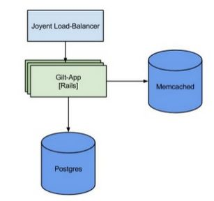
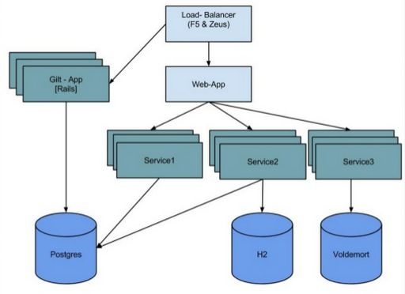
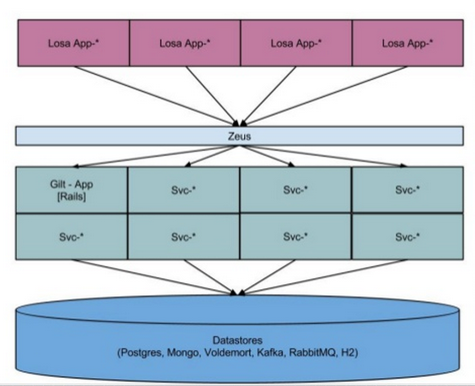

## Gilt

Gilt is an online shopping website based in the United States. Gilt Groupe was founded in 2007 and has over 6 million members.

**Founded**: 2007

Gilt transformed its **monolithic Rails** application into a distributed, fault-tolerant, scalable architecture built on **Scala microservices**.

### References
- [Gilt Case stady from Typesafe](http://downloads.typesafe.com/website/casestudies/Gilt-Live-Case-Study-v1.3.pdf)
- [Interview With Eric Bowman of Gilt.com](http://code.tutsplus.com/articles/interview-with-eric-bowman-of-giltcom--net-35653)
- Interview [How Gilt's Insane Traffic Spikes Pushed It Off Rails To Scala](http://readwrite.com/2014/05/08/gilt-eric-bowman-interview-scala-rails-jvm-reactive-platform)
- **Slides**:
  - [Scaling Gilt" at Gilt: NYC Tech Talks Comes to 2 Park](http://www.slideshare.net/LappleApple/gilt-from-monolith-ruby-app-to-micro-service-scala-service-architecture)
  - [Scaling Gilt: from Monolithic Ruby Application to Distributed Scala Micro-Services Architecture](http://www.slideshare.net/InfoQ/scaling-gilt-from-monolithic-ruby-application-to-distributed-scala-microservices-architecture)
- **Videos**:
  - [Scaling Microservices at Gilt](https://www.youtube.com/watch?v=ZxE_wLWu1x4)
  - [CUFP 2013: Kevin Scaldeferri: Enabling Microservice Architectures with Scala](https://www.youtube.com/watch?v=EDbO47MKljQ)

### Case Study

These notes are based on ["Scaling Gilt" at Gilt: NYC Tech Talks Comes to 2 Park"][1].

Gilt is classic startup story.
2007 RoR hot thing. The goal was to get to the marker.

Initial Tech stack
- Postgresql
- Memcashed
- Ruby on Rails

Tech pain points 2009:
- 2009 Spike required to launch 1,000s of ruby processes
- Postgres was overloaded
- Routing traffic between ruby processes sucked

Dev pain points:
- 1000 Models/Controllers, 200K LOC, 100s of jobs
- Lots of contributors + no ownership
- Difficult deployments with long integration cycles
- Hard to identify root causes

We needed to solve the problem fast.

#### Initial architecture

#### Micro service architecture started to get traction

This architecture did not solved dev pain points.

> **LOSA** - Lots of Small Apps

#### Moving to Micro Service

##### Decision Table on moving to Micro Services

The Good | The Ugly
--- | ---
Easier to develop with more than 30 engineers | Hard to maintain integration environment
Big problems are broken to smaller ones | Build custom tools for deployment
Provide unique hardware needs for different features | Monitoring is much harder
Teams handle their own deploy | Dependency Hell

[1]: http://tech.gilt.com/post/73434506726/scaling-gilt-at-gilt-nyc-tech-talks-comes-to-2
