## Groupon

Groupon is a deal-of-the-day website that features discounted gift certificates usable at local or national companies.

**Founded**: January 2008

### References

 - [I-Tier: Dismantling the Monolith](https://engineering.groupon.com/2013/misc/i-tier-dismantling-the-monoliths) actual case study of migration
 - [I-Tier: Breaking Up the Monolith](http://www.slideshare.net/mcculloughsean/itier-breaking-up-the-monolith-philly-ete)
 - **Videos**:
   - [JavaZone: I-Tier: Breaking Up the Monolith, by Brian McCalliser][JavaZone]
   - [Chariot Solutions: I-Tier: Breaking Up the Monolith, by Sean McCullough][Chariot Solutions]

### Case Study

We recently completed a year-long project to migrate Groupon’s U.S. web traffic from a **monolithic Ruby on Rails** application to a new **Node.js** stack with substantial results.

We are not using Nginx, switched to Vert.x. It's much easier to write extension and custom routing.

Also, we are using [Apache Mesos](http://mesos.apache.org/).

#### The original Rails architecture
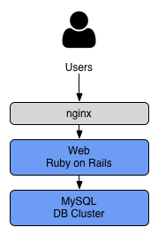

#### Extended Architecture
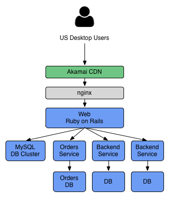

#### Going Global
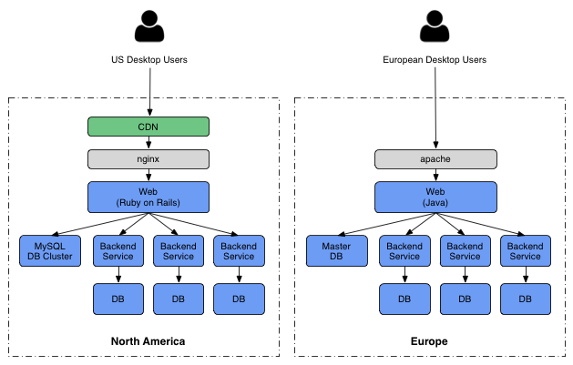

#### Mobile
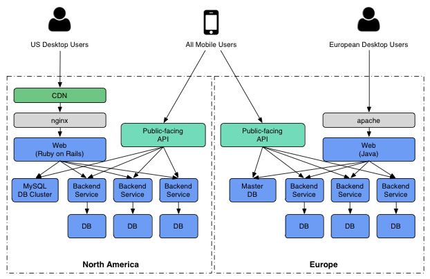

### Split each major feature of the website into a separate web application
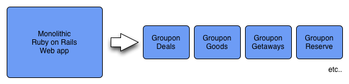

### Routing layer
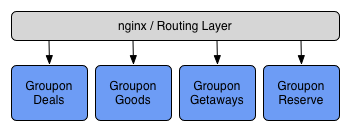

### Single federated API layer that serves both our web and mobile apps
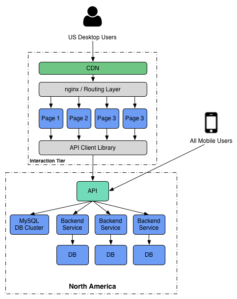

### Still need to support two backends
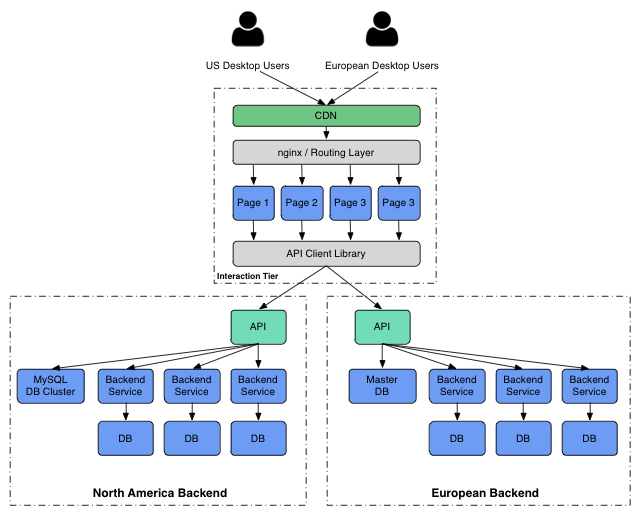

### Video Notes

Here are note to [JavaZone I-Tier: Breaking Up the Monolith, by Brian McCalliser][JavaZone]

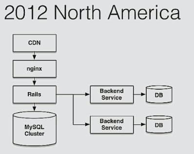

Groupon failed with those Rails monolith architecture
- Could not build feature fast enough
- Wanted to build features worldwide
- Mobile and web lacked features parity
- We are stuck

#### Implemented Layout service for storing and providing layout for different micro-apps:
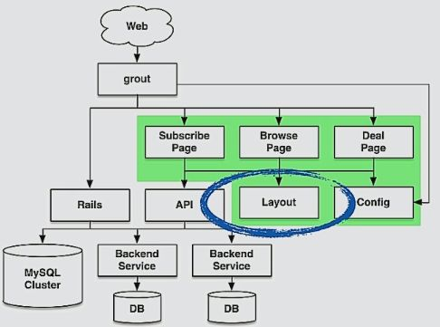

#### Layout Service in/out:
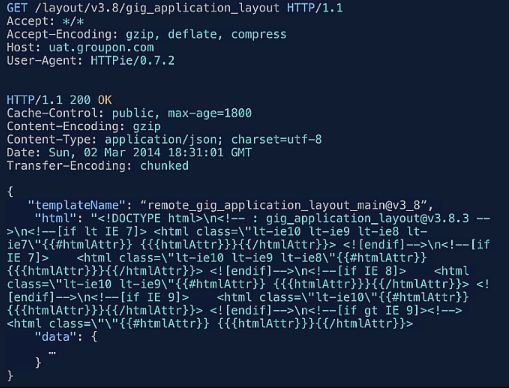

##### Sample layout with placeholders:
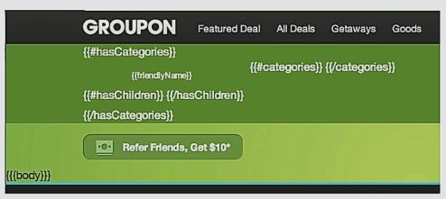

#### Groupon has "nice" architecture for North America, but monolith for Europe and Asia:
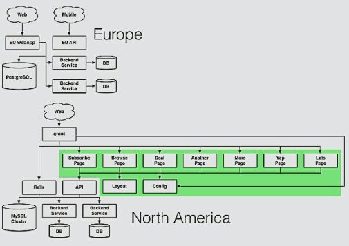

[JavaZone]: https://vimeo.com/105880150
[Chariot Solutions]: https://vimeo.com/96250640
