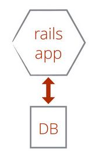
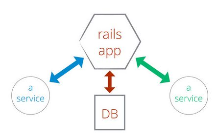
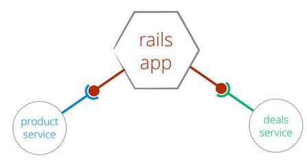
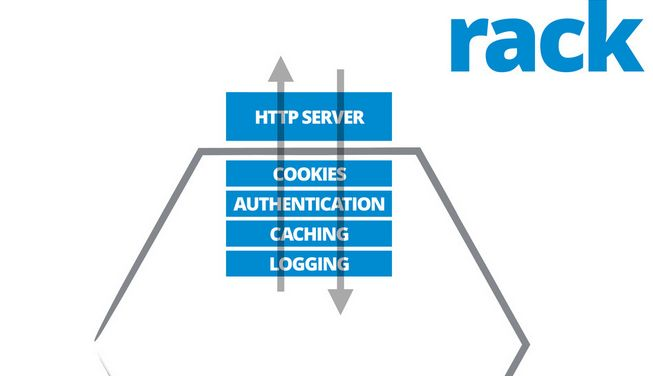
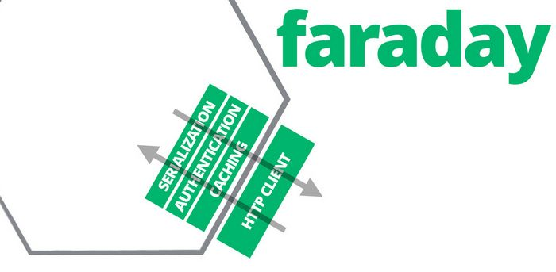

## RailsConf 2014 - Rails as an SOA Client by Pete Hodgson

Our monolithic apps are evolving into ecosystems of connected services. It's becoming quite common for Rails apps to be working mainly as clients to other services. In this talk we'll cover tools and techniques for a happy and productive existence when your Rails app is acting as a front end to other services.

Pete Hodgson is a lead consultant with ThoughtWorks. He helps teams get more awesome by delivering quality maintainable software at a sustainable pace, using agile practices like test-driven design, pairing and continuous delivery.

Presenter concentrates on development issues, especially testing external services, tools and libs used for this.

### References

- [slides](https://speakerdeck.com/phodgson/railsconf2014)
- [video](https://www.youtube.com/watch?v=CzF3g_JM1YQ)

#### Monolith Rails App

#### Rails App and services

#### Rails App and ext services

#### Rack stack

#### Faraday stack

