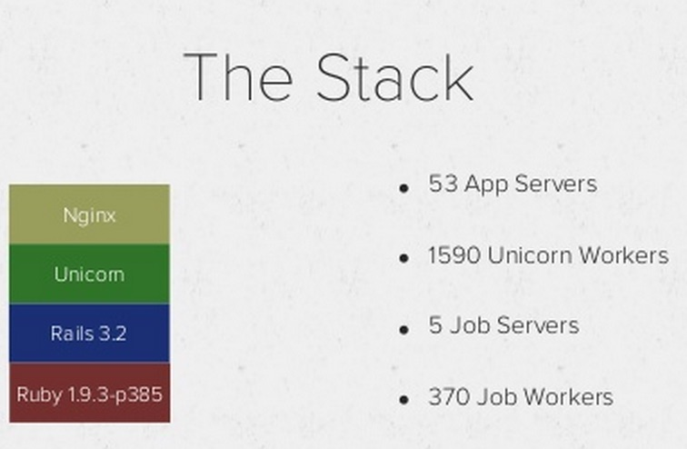
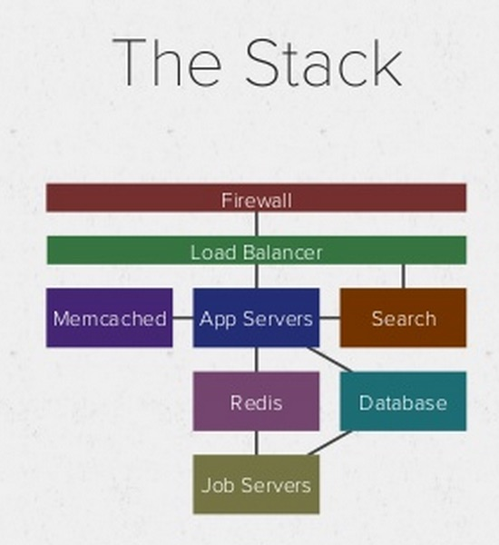
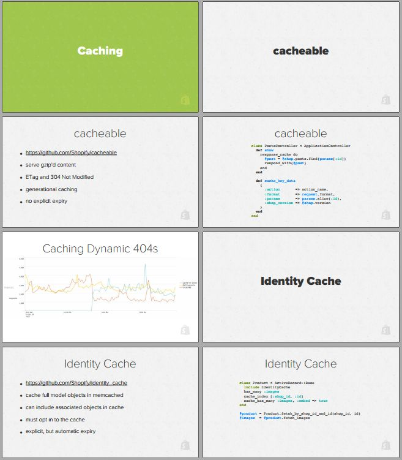
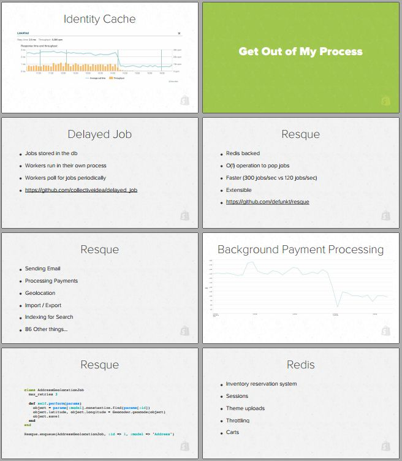
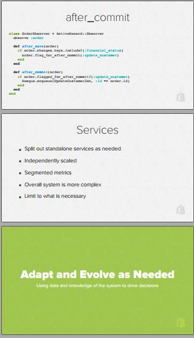
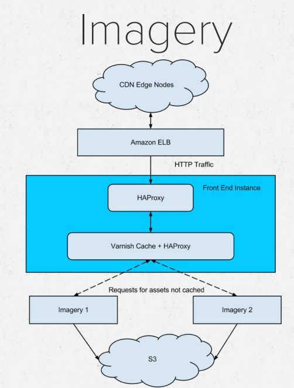

## Shopify

Shopify is a Canadian commerce company headquartered in Ottawa, Ontario that develops computer software for online stores and retail point-of-sale systems

**Founded**: 2004

### References
- **Video**:
  - [Big Ruby 2013 How Shopify Scales Rails by John Duff](https://www.youtube.com/watch?v=j347oSSuNHA)
- [Slides](http://www.slideshare.net/jduff/how-shopify-scales-rails-20443485)

### Case Study

John Duff shared own case study of Rails scaling issues.

**Tech Stack**:
  - Ruby 1.9.3-p385
  - Rails 3.2
  - Percona MySQL 5.5
  - Unicorn 4.5
  - Memcached 1.4.14
  - Redis

- Caching via Memcached
- Identity Cache (Memcached backed)
- Delayed Jobs
  - Jobs Stored in DB
  - Worker run in their own process
  - Worker poll for jobs periodically
- **Resque**
 - Sending Emails
 - Process payments
 - Geolocation
 - Import/Export
 - Indexing for Search
- **Redis**
 - Sessions
 - Theme uploads
 - Throtting
- **After commit**
  - Webhooks
  - cache expiry
  - Update associated objects
  - After transaction
