## SoundCloud

SoundCloud is a Swedish online audio distribution platform based in Berlin, Germany, that enables its users to upload, record, promote, and share their originally-created sounds.

**Founded**: August 2007

### References
- [Evolution of SoundCloud’s Architecture][Evolution Architecture] This is a story of how we adapted our architecture over time to accomodate growth.
- [From a monolithic Ruby on Rails app to the JVM](http://www.slideshare.net/pcalcado/from-a-monolithic-ruby-on-rails-app-to-the-jvm)
- [Evolution of AMQP at SoundCloud][Evolution of AMQP at SoundCloud]
- **Building Products at SoundCloud**
    - [Building Products at SoundCloud - Part I: Dealing with the Monolith](https://developers.soundcloud.com/blog/building-products-at-soundcloud-part-1-dealing-with-the-monolith)
    - [Building Products at SoundCloud - Part II: Breaking the Monolith](https://developers.soundcloud.com/blog/building-products-at-soundcloud-part-2-breaking-the-monolith)
    - [Building Products at SoundCloud - Part III: Microservices in Scala and Finagle](https://developers.soundcloud.com/blog/building-products-at-soundcloud-part-3-microservices-in-scala-and-finagle)
- [InfoQ - Moving from a Monolith to Microservices at SoundCloud](http://www.infoq.com/news/2014/06/soundcloud-microservices)
- **Patterns:**
  - [Public, but not Published Interface](http://martinfowler.com/ieeeSoftware/published.pdf)
  - [Bounded Context](http://martinfowler.com/bliki/BoundedContext.html)
  - [Event Sourcing](http://martinfowler.com/eaaDev/EventSourcing.html)

### Case Study

This is a story of how we adapted our architecture over time to accomodate growth. Scaling is a luxury problem and surprisingly has more to do with organization than implementation. For each change we addressed the next order of magnitude of users we needed to support, starting in the thousands and now we’re designing for the hundreds of millions.  We identify our bottlenecks and addressed them as simply as possible by introducing clear integration points in our infrastructure to divide and conquer each problem individually.

SoundCloud was born on **Rails**. It allowed to iterate real fast and keep code quality up.

Rails is simple, if you want to write a toy blog engine.
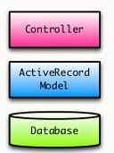

In real world Rails become *messy*.
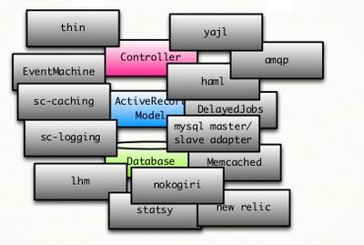

- no concurrency? Spawn A LOT of processes
- make everything a background job
- no proper GC, get used to restarting process, frequently
- scaling Rails development is hard
- effective controllers and models have a lot of logic

#### Architecture evolution diagrams based on [Evolution Architecture]

1. 

1. 

1. 

1. 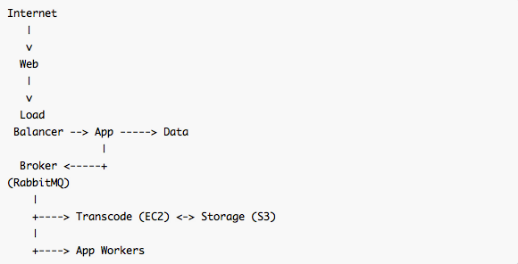

1. 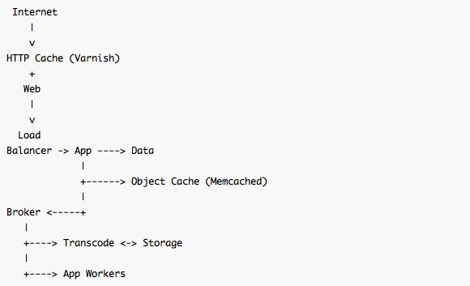

1. 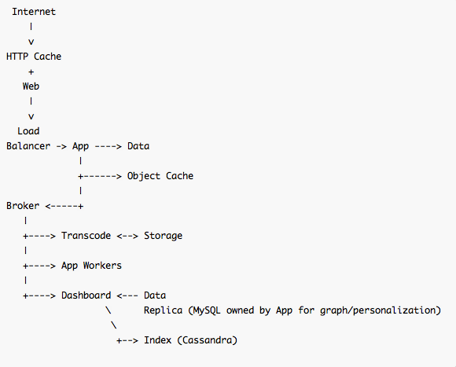

1. 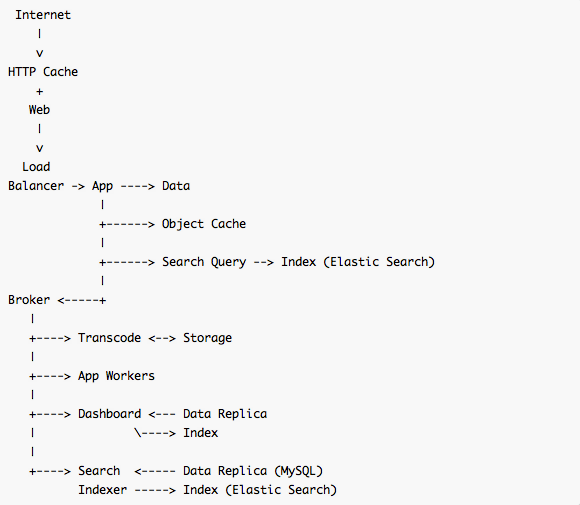

1. 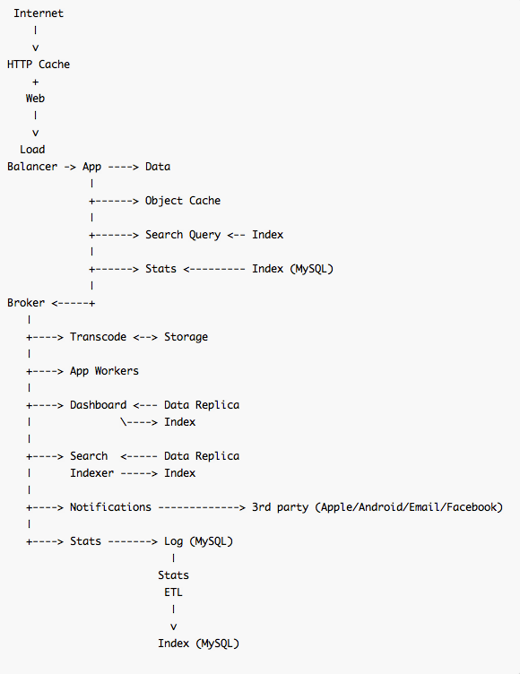

1. 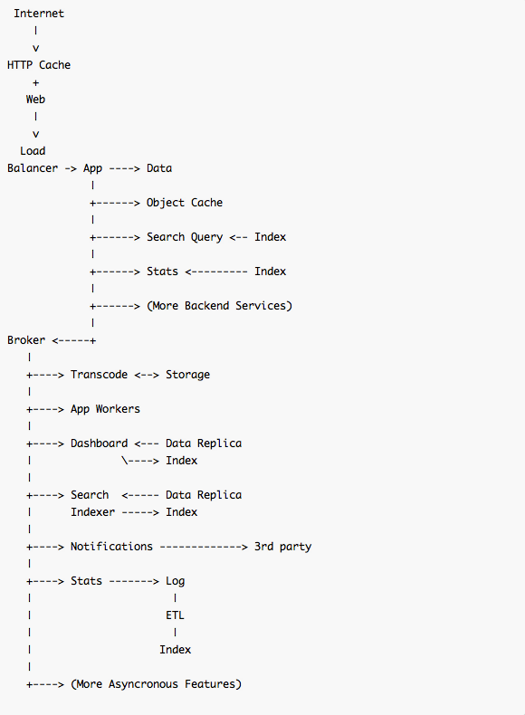

**Tech stack:**
 - HAProxy
 - Nginx
 - RabbitMQ
 - Cassandra
 - Memcashed
 - Varnish
 - ElasticSearch

#### AMQP

These images are based on [Evolution of AMQP at SoundCloud]
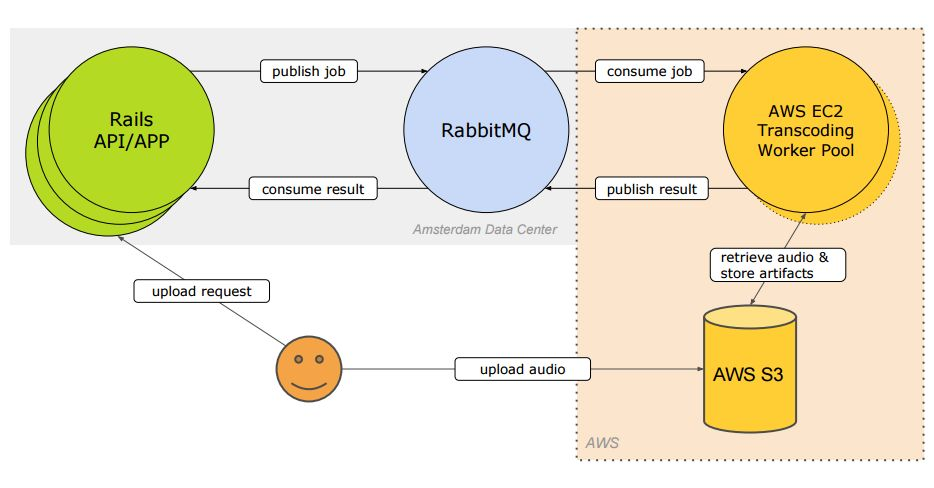

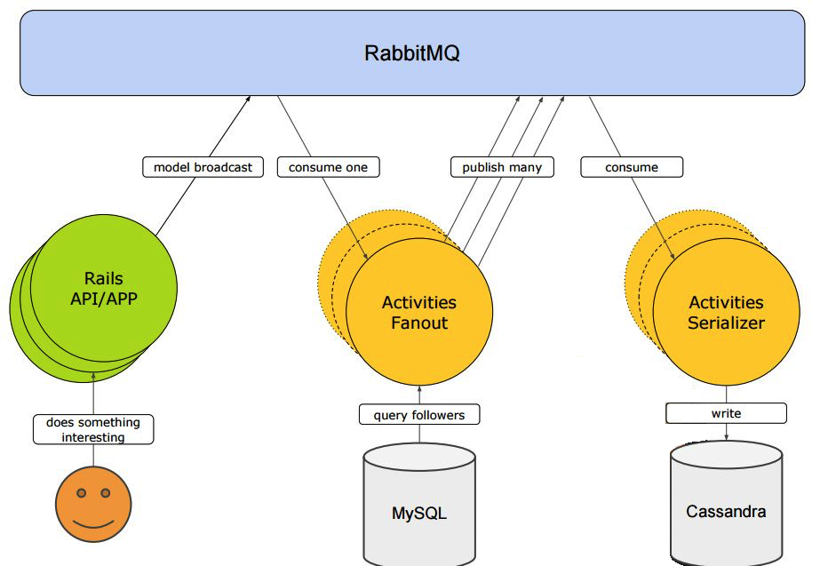

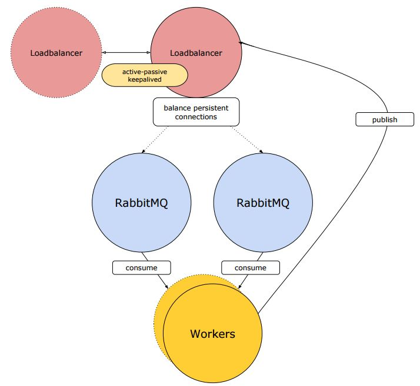

[Evolution of AMQP at SoundCloud]: http://www.infoq.com/presentations/amqp-soundcloud
[Evolution Architecture]: https://developers.soundcloud.com/blog/evolution-of-soundclouds-architecture
