[[Back](README.md)]
## Wanelo
Wanelo is a digital mall where people can discover and buy products on the internet. The site has over 12 million products posted by users from over 300,000 stores, including both large brands and independent sellers, like those found on Etsy.

Wanelo **launched** in 2012.

### References
- [Enterprise Architectures with Ruby (and Rails) (Konstantin Gredeskoul, CTO at Wanelo)](http://www.slideshare.net/kigster/enterprise-architectures-with-ruby-and-rails%20)

### Case Study
Very detailed case study.

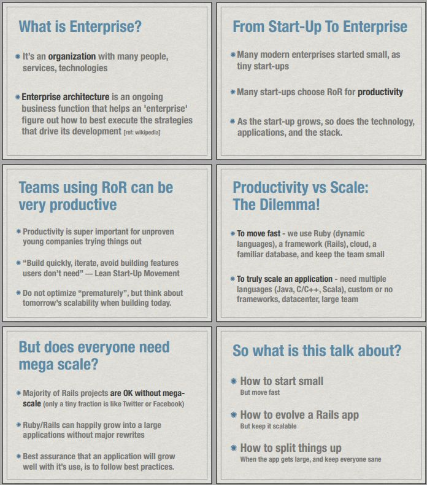

#### Data matters the most
- Relational Databases: PostgreSQL, MySQL
  - High consistency, reliability, decades of research,
great performance, gets tricky at mega-scale
- BigTable based: MongoDB, HBase
  - Eventual consistency, recent, have indexes, almost table-like. Also tricky at mega scale.
- Amazon Dynamo like: RIAK, Voldemort
  - Distributed hash-table, tricky from the very
beginning.

#### What to choose?
- Without a strong reason otherwise, choose a relational database. I prefer PostgreSQL.
- Instagram scaled on PostgreSQL very well
- If under pressure and in doubt, it’s OK to choose whatever you are familiar with

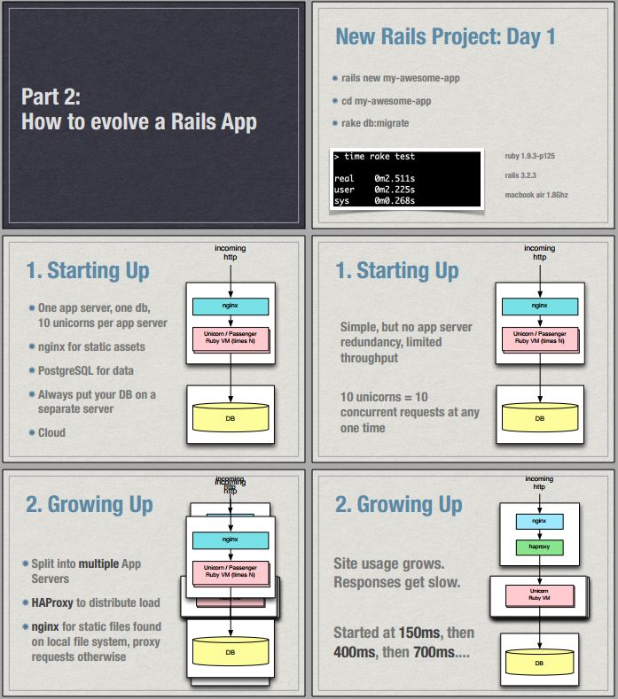

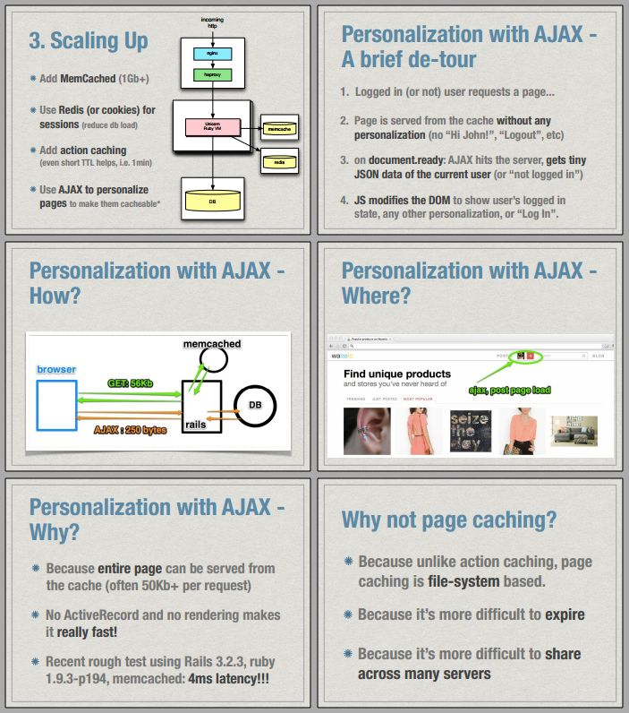

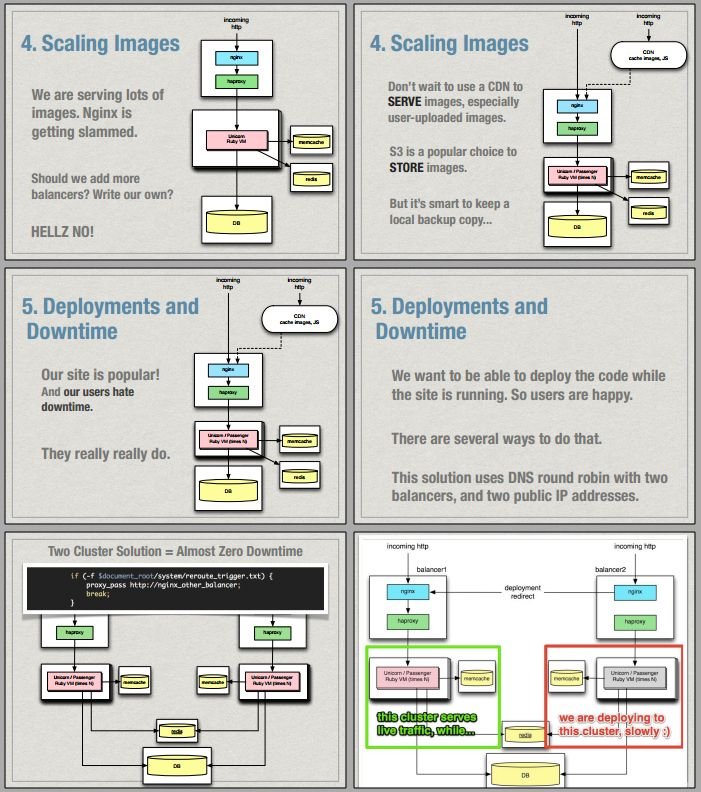

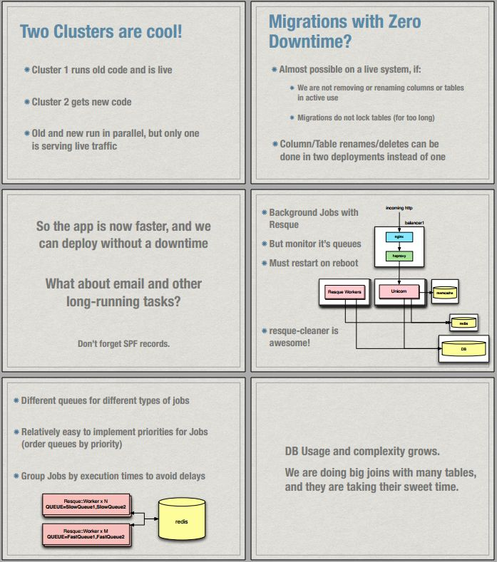

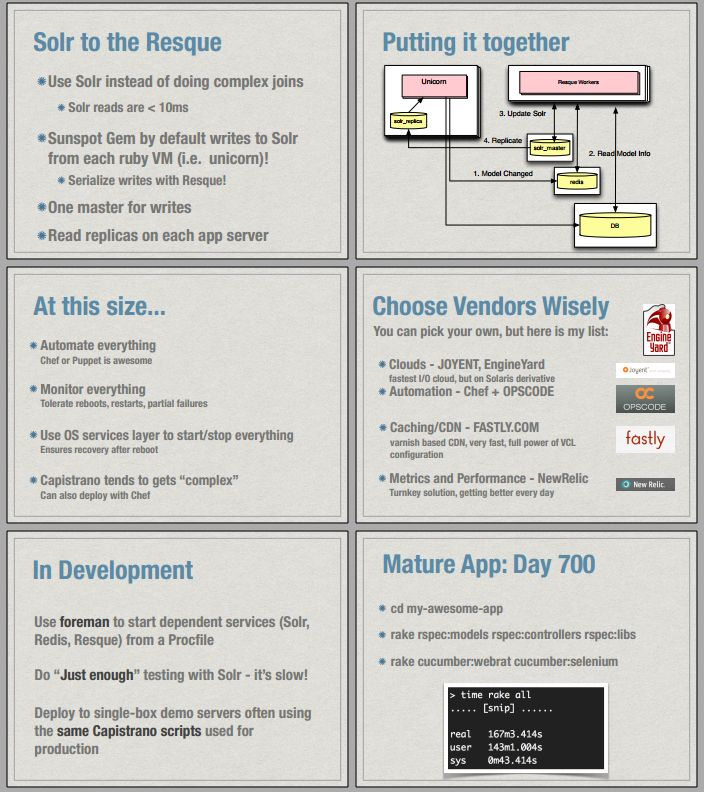

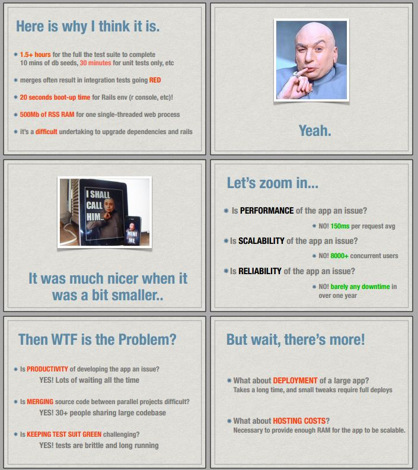

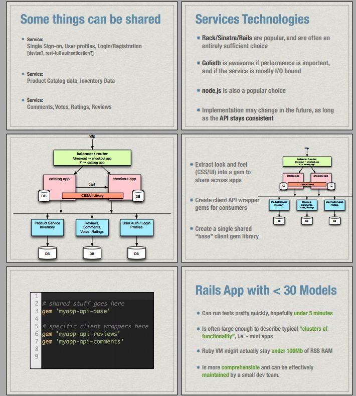

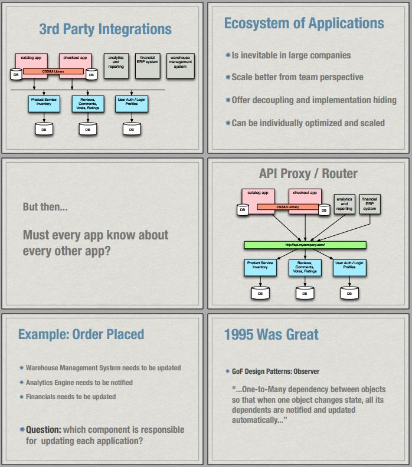

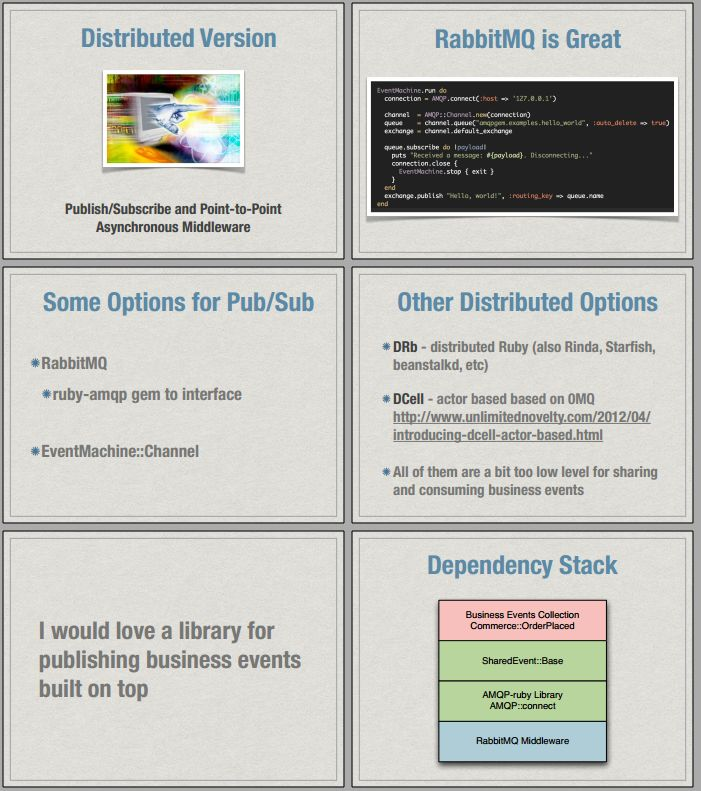

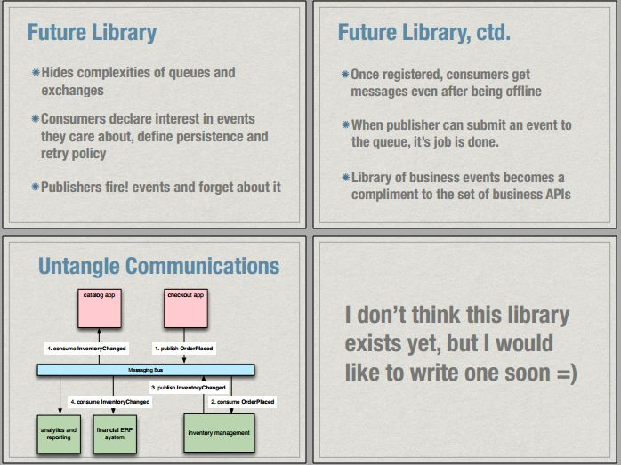
