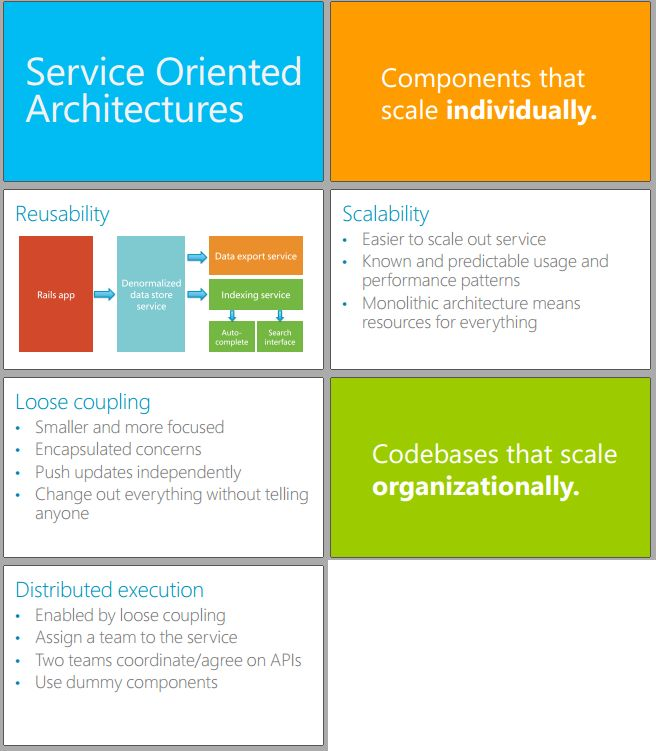
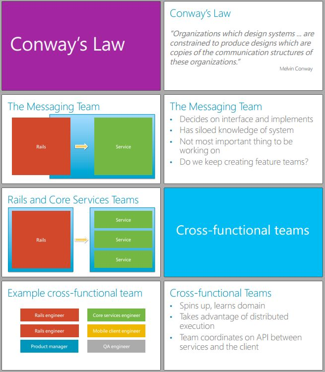
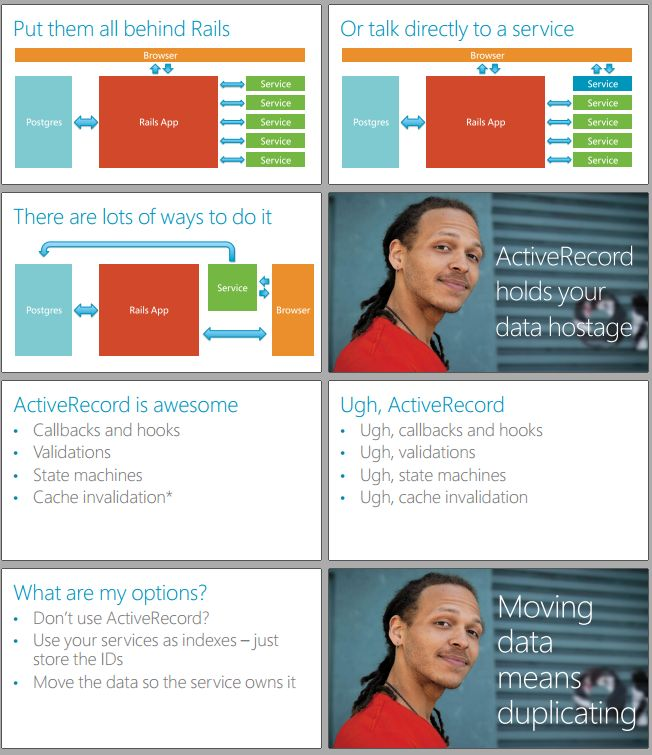
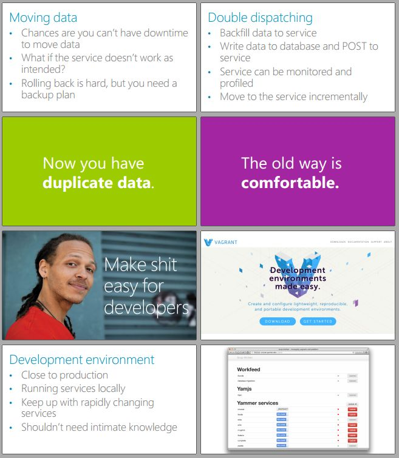
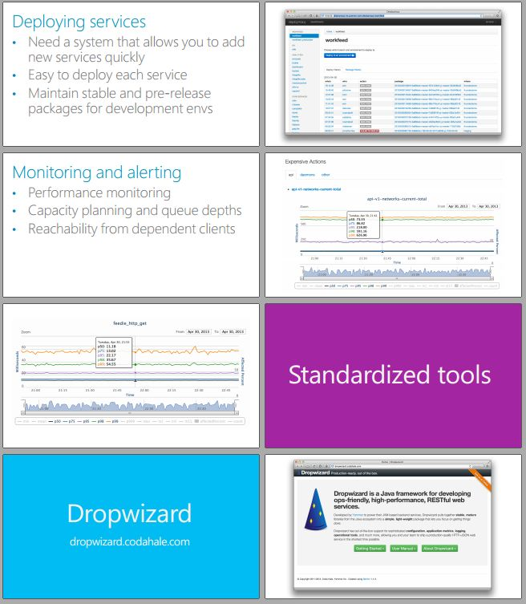

## Yemmar

Yammer, Inc. is a freemium enterprise social networking service that was **launched** in 2008 and sold to Microsoft in 2012 for US$1.2 billion

### References
- **Video**:
  - [Ruby On Ales Services and Rails: The Shit They Don't Tell You by Brian Morton](https://www.youtube.com/watch?v=6OWHGGCj_yU)
- **Slides**:
  - [Services and Rails: The Shit They Don't Tell You (RailsConf 13 Edition) by Brian Morton](https://speakerdeck.com/bmorton/services-and-rails-the-shit-they-dont-tell-you-railsconf-13-edition)

### Case Study

#### Fun Facts
- Over 100 web, 40 memcache servers
- ~500 million requests/day to Rails app
- 98% cache hit rate
- ~240,000 memcache gets/sec
- ~20 billion memcache gets/day

#### Not Fun Facts
- Test suite takes ~10 hours
- Jenkins parallelized across 20 EC2 instances, takes ~20 min

We have a huge Rails app
- 300+ models, 200 controllers
- 20+ JVM services
- Some services do over a billion requests per day

> but we still have a huge Rails app

#### Slides

**SOA Service tradeoffs**:
- Handle unavailability
- Transactions aren’t free
- APIs are much harder to change
- There are no atomic deploys

> - Always reevaluate your costs and their viability.

> - Be ready to be wrong

- **Q1: What should I extract out into a service?**
  - Things that...
  - Have little state or don't mutate sate
  - Are new enough to not be tightly coupled
  - Don't exist yet
  - Hard to extract, but about to kill you

- **Q2: Not everything work well ...**
  - We A/B test everything
  - Performance issues, tech debt
  - Experiments service

- **Q3: Why not a service?**
  - The problems we thought we had weren't as bad as we thought
  - We haven't solved the date prisoner problem yet
  - Service can be an excuse to start over
